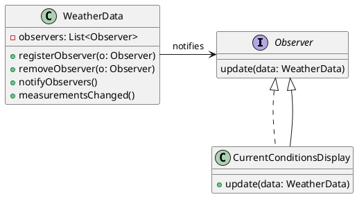
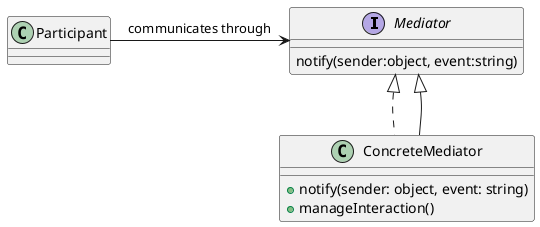

Here is the final Markdown file for the Observer pattern description with detailed sections and PlantUML diagrams:
 
```markdown
# Structure of Patterns

Design patterns offer solutions to common design problems, providing a reusable template. Below is a structured approach to document these patterns:

## 1. Pattern Name
- **Description:** A unique and descriptive name that summarizes the pattern, making it easy to identify and refer to.

## 2. Problem
- **Context:** 
  - What is the recurring issue the pattern addresses?
  - Situations or circumstances where this pattern is relevant, highlighting why the problem needs a solution.
  
## 3. Solution
- **Mechanism:** 
  - A high-level overview of how the pattern resolves the problem.
  - Detailed description of the core concept that defines the pattern, including any key principles and strategies.

## 4. Consequences
- **Impacts:** 
  - The results of using the pattern, including benefits (e.g., improved code maintenance, scalability) and drawbacks (e.g., increased complexity).
  - Discuss trade-offs involved, and how they affect the overall design and system performance.

## 5. Implementation
- **Guidelines:** 
  - Detailed steps or methodologies for implementing the pattern in software development.
  - Common pitfalls and challenges, alongside recommendations to overcome them.
  - Considerations for adapting the pattern to specific programming languages or frameworks.

## 6. Example
- **Illustration:** 
  - A concrete example demonstrating the application of the pattern.
  - Step-by-step explanation of how the pattern is implemented in this example.



## Related Patterns
- **Relationships:** 
  - Describe other patterns that are related, either as alternatives or complementary solutions.
  - Explain how this pattern can be integrated with other patterns to address different aspects of a problem.



# Example: Observer Pattern

## Pattern Name
- **Observer Pattern**

## Problem
- **Context:** 
  - In a scenario where multiple objects need to stay updated with the state of another object without tight coupling.
  - Often arises in GUI applications where user interface components need to display and update based on changing data.

## Solution
- **Mechanism:** 
  - Establish a one-to-many relationship between a subject and its observers.
  - The subject keeps a list of its observers, adds or removes them as needed, and notifies them of any state changes, allowing observers to react accordingly.

## Consequences
- **Impacts:** 
  - Loose coupling between the subject and its observers, promoting scalability and ease of maintenance.
  - Observers can be added or removed dynamically without affecting the subject.
  - However, can result in a large number of objects needing to be managed, requiring careful observer management and synchronization.

## Implementation
- **Guidelines:** 
  - Implement an interface for observers to define the update method.
  - Make the subject maintain a list of observers, and provide methods to add, remove, and notify them.
  - Ensure that the notification process does not tightly bind business logic to observer management.

## Example
- **Illustration:** 
  - Consider a weather station system where the `WeatherData` class updates various display elements with current conditions. The `CurrentConditionsDisplay` implements the `Observer` interface and updates its display whenever notified of changes in the weather data.


## Related Patterns
- **Observer with Mediator:** 
  - If complex communication is needed across observers without direct dependencies, the Mediator pattern can facilitate this interaction.
  - Mediator can coordinate interaction among observers, reducing direct connections between them and promoting cleaner communication.


This enhanced structured format provides depth at each stage of the pattern explanation, ensuring comprehensive understanding and implementation guidance.
```

This Markdown file offers detailed sections and visual diagrams to convey the structure and implementation of the Observer pattern comprehensively.
